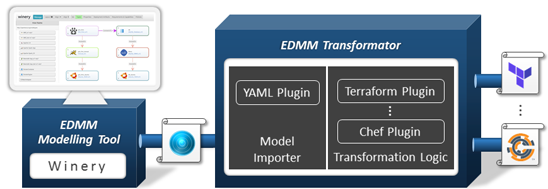

# EDMM Transformation and Deployment Framework

[](https://opensource.org/licenses/Apache-2.0)
[](https://travis-ci.org/UST-EDMM/edmm)
[](https://www.codacy.com/manual/miwurster/edmm?utm_source=github.com&amp;utm_medium=referral&amp;utm_content=UST-EDMM/edmm&amp;utm_campaign=Badge_Grade)
[](https://jitpack.io/#UST-EDMM/edmm)

EDMM provides a declarative model describing the components to be deployed, their configurations, required artifacts, and relations among them.
The resulting EDMM model is independent of any specific deployment technology and can be exported from an EDMM-enabled modeling tool or created directly using a text editor according to the respective YAML specification.
This model can be fed into the EDMM Transformation and Deployment Framework, which provides a command-line interface (CLI) that can either be used directly by the user or integrated into any automation workflow.
The CLI can be used to select the desired target deployment technology into which the EDMM model is to be transformed.
The output is an executable technology-specific deployment model that can be executed with the selected technology.
The following figure shows an high-level overview of the EDMM Transformation Framework.


## Transformation 



[Link to the video: https://youtu.be/MGWBFomOGYU](https://youtu.be/MGWBFomOGYU)

The demo is split into two parts.
First, we start with the EDMM Modeling Tool, which is based on [Eclipse Winery](https://github.com/eclipse/winery), in order to graphically model an EDMM-based application deployment.
The EDMM Modeling Tool is able to export an EDMM YAML file according to the [specification](https://github.com/UST-EDMM/spec-yaml).
After the EDMM model has been downloaded it can be fed into the EDMM Transformation Framework.
For example, to convert the supported scenario into Kubernetes resource files one can run the `edmm` CLI tool as follows:

```shell
edmm transform kubernetes ./edmm-model.yml
```

The generated Kubernetes resource files are located relative to the `edmm_model.yml` file inside a `kubernetes` directory.
For the supported scenario, the tool will create two separate Kubernetes stacks, each consisting of a Service resource, a Deployment resource wired with the service, and a generated `Dockerfile` containing the layers expressed by the EDMM model.
By building the Docker images (`docker build -t <name> .`) one can apply the Kubernetes resources to a cluster (`kubectl apply -f <files>`).


## Usage

The final distribution package can be downloaded form the [releases](https://github.com/UST-EDMM/transformation-framework/releases) page.
Extract the files to a location on your filesystem and add it to your path variable (Linux: `$PATH`, Windows: `%PATH%`).
Afterwards you can invoke the `edmm` command from a command prompt.

The transformation framework supports YAML files as input, according to the published [YAML specification](https://github.com/UST-EDMM/spec-yaml).
Specified components, and their respective component types, must be supplied in a single file at the moment.
However, we introduce a couple of built-in component types that can be used to model an application deployment.
An [example](edmm-core/src/test/resources/templates/scenario_iaas.yml) shows the usage of the built-in types to model an application deployment based on virtual compute resources, e.g., virtual machines having some software components installed.

The transformation can be started by using the `transform` command of the `edmm` tool: `edmm transform <target> <input>`.
You have to specify the `target` technology (e.g., one of "ansible", "azure", "chef", "compose", "heat", "kubernetes", "terraform") and the `input` EDMM YAML model file.
The generated technology-specific deployment models will be stored relative to the YAML input file.


## Plugins

Each plugin implements its own transformation logic by providing a respective `Plugin` implementation.
Further, a plugin implements different lifecycle methods, e.g., `checkModel()`, `prepare()`, and `cleanup()`, but must provide an implementation for the `transform()` method.
Currently we support the following list of plugins:

* [Ansible](edmm-core/src/main/java/io/github/edmm/plugins/ansible)
* [Azure Resource Manager](edmm-core/src/main/java/io/github/edmm/plugins/azure)
* [Chef](edmm-core/src/main/java/io/github/edmm/plugins/chef)
* [Docker Compose](edmm-core/src/main/java/io/github/edmm/plugins/compose)
* [Heat Orchestration Template](edmm-core/src/main/java/io/github/edmm/plugins/heat)
* [Kubernetes](edmm-core/src/main/java/io/github/edmm/plugins/kubernetes)
* [Terraform](edmm-core/src/main/java/io/github/edmm/plugins/terraform)
* [Puppet](edmm-core/src/main/java/io/github/edmm/plugins/puppet)
* [Cloudify](edmm-core/src/main/java/io/github/edmm/plugins/cloudify)
* [AWS CloudFormation](edmm-core/src/main/java/io/github/edmm/plugins/cfn)
* [Salt](edmm-core/src/main/java/io/github/edmm/plugins/salt)
* [Juju](edmm-core/src/main/java/io/github/edmm/plugins/juju)
* [CFEngine](edmm-core/src/main/java/io/github/edmm/plugins/cfengine)

The corresponding plugin README.md contains detailed information of the transformation rules each plugin employs.


## Built-in Types

The framework provides built-in types that can be used to model in EDMM.
Simply copy and paste the [types](docs/types.yml) to your model file.
An example showing the usage of these types is available [here](edmm-core/src/test/resources/templates/scenario_iaas.yml).

## Build the project

We use Maven as our build tool:

```shell
./mvnw clean package
```

Build the `edmm-web` Docker image:

```shell
docker build -t edmm-web -f .\edmm-web\Dockerfile .
docker run -it -p 5000:5000 edmm-web
```
