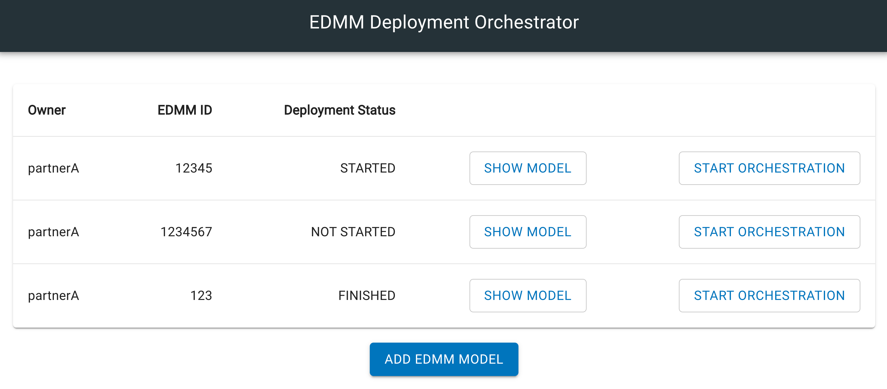

# Multi Participant and Technology Deployment

The prototype in [edmm-orchestration](https://github.com/UST-EDMM/edmm/tree/master/edmm-orchestration) enables
a decentralized deployment with (i) multiple participants and (ii) different deployment technologies using workflow technologies.
Based on the EDMM model, a participant-specific BPMN workflow is generated and then fed to the 
Framework for the automated deployment execution. So far, Terraform, Ansible, and Kubernetes are supported.

## Concept 
In the first step, a Global Deployment Model (GDM) is defined that describes the structure of the whole application. This is done by creating an EDMM model using the presented syntax in YAML. 
Next, the created EDMM model is further annotated with multiple components and their respective participants that have to be deployed on the participant's side. 
After this step, the EDMM model is shared between all participants and their respective components are annotated with the technology-specific regions. Since each participant has its own model, these models are called Local Deployment Model (LDM). 
Furthermore, the resulting LDM is then transformed in several executable DTSMs. Further, the deployment order based on the LDM is determined, and a BPMN workflow is generated. 
At last, the generated BPMN workflows can be used for the workflow engine and execute the automated deployment. 

## Requirements
-  The `repository.path` in the `application.properties` has to be set and all relevant information, such as artifacts and scripts, have to be provided in the repository directory. 
- The EDMM Transformation Framework has to be running 
- The GUI in [edmm-orchestration-ui](https://github.com/UST-EDMM/edmm/tree/merge-multi-choreo/edmm-orchestration-ui) has to be running

## Usage

### 1. Annotation of a GDM
A global EDMM model (GDM) has to be created and all relevant information, e.g. components, component types, relations, etc., provided with the 
EDMM syntax. In this step, the GDM is further annotated with all participants and their respective components, as seen in the following sample:

```
multi_id: 12345

participants:
  partnerA:
    endpoint: http://localhost:5000
    components: 
      - ubuntu_db
      - db
      - dbms
  partnerB: 
    endpoint: http://localhost:5001
    components: 
      - ubuntu_app
      - pet_clinic
      - pet_clinic_tomcat
```

`multi_id` is additionally set as a unique identifier for the GDM before distribution of the GDM to all participants.

### 2. Annotation of a LDM

The GDM is distributed to all participants, with each participant having their own LDM. Here, technologies for the corresponding
participant are set. Furthermore, the `owner` of the LDM is added to distinguish between other LDMs. A sample LDM for *partnerB* can be defined as follows:
 
```
version: edm_1_0
multi_id: 12345
owner: partnerB

orchestration_technology:
    terraform:
        - ubuntu_db
    ansible:
        - dbms
        - db
    
participants:
  partnerA:
    endpoint: http://localhost:5000
    components: 
      - ubuntu_db
      - db
      - dbms
  partnerB: 
    endpoint: http://localhost:5001
    components: 
      - ubuntu_app
      - pet_clinic
      - pet_clinic_tomcat
```

Note: Only technologies of the respective participant (in this case *partnerB*) has to be annotated. 

### 3. Generate BPMN workflow

Based on the LDM, a BPMN workflow is generated. There are currently two ways on how this is done. 

#### 3.1 Using GUI
Using the GUI, the LDM has to be uploaded using **ADD EDMM MODEL**. In the background, the LDM is parsed and automatically
sent to the EDMM Framework for the transformation and generation of DTSMs and a BPMN workflow. After workflow generation, the GUI
handles the upload of the BPMN workflow to the integrated Camunda engine. 



Note: The generated BPMN workflow is participant-specific and therefore only contains deployment steps, which are relevant for the `owner` of the LDM. 

#### 3.2 Using REST API
Steps which are handled by the GUI in the background can be done manually by calling multiple REST APIs. 

**Step 1:** For the upload of the LDM to the EDMM Framework, `POST`:  `/orchestration/transform` has to be called with the `"target": "multi"` and the LDM as an `input` as a base64:
```
{
    "target": "multi",
    "input": <base64>
}
```

**Step 2:** The generated BPMN workflow under the repository directory has to be uploaded to the Camunda engine. 
This can be done by calling `POST`: `/engine-rest/deployment/create` with the following form-data:

| key | value  | content type  |   
|---|---|---|
| deployment-name  |  <deployment-name> |  text/plain |    
|  deployment-source | <deployment-source> |  text/plain |   
| tenant-id | <multi_id> |  text/plain |   
| bpmn-workflow.bpmn | <workflow.bpmn> | application/octet-stream  |   

Note: `deployment-name` and `deployment-source` can be an arbitrary value defined by the participant. `tenant-id` has to match the `multi_id` of the GDM and serves
as an identifier in the engine. The `workflow.bpmn` defines the generated BPMN workflow file in the repository directory. 
 
### 4. Initiate deployment execution
The deployment can be started by an arbitrary participant either by using the GUI or through the REST API.

#### 4.1 Using GUI

Using **START ORCHESTRATION**, the uploaded workflow is executed by the Camunda Engine.

#### 4.2 Using REST API

Using the REST API: ``POST``: ``/engine-rest/process-definition/key/workflow/tenant-id/<multi_id>/start`` with the following request body:

```
{
    "variables": {
        "initiator": {
            "value": "true"
        }
    }
}
```

## Usage (Only technologies)
For the deployment of different technologies without further participants, the CLI can be used and started by using
`edmm transform multi <input>` in the directory of the EDMM file. Further information is provided in the [multi-technology-deployment](https://github.com/UST-EDMM/edmm/tree/master/docs/multi-technology-deployment)
section.

## What happens?

### Implementation details

The Camunda engine serves as an orchestrator, which manages the BPMN tasks for the deployment and data exchange between 
the other participant's Camunda engine. Each BPMN task is linked to a custom Java Delegate implementation and
defines custom logic on how the task has to be executed. The following Java Delegates have been implemented for the prototype:

``Initiate`` - ``InitiateDelegate.java``: Handles the initiation of the workflow. If the initiate task has already been executed and directly skipped to the other
BPMN tasks.

``Send`` - ``SendDelegate.java``: Handles the data exchange between the other participant by sending out properties.

``Deploy`` - ``DeployDelegate.java``: Handles the deployment of a specific technology. A sample ``Deploy`` Request Body is shown as follows:

```
{
    "modelId": "12345",
    "correlationId": "eb0fbb4b-d564-4aa8-a7e3-cec5aba9414f",
    "components": [
        "pet_clinic"
    ],
    "inputs": [
        {
            "component": "db",
            "properties": {
                "hostname": "193.196.55.67"
            }
        }
    ]
}
```

### Property injection
For the deployment of specific components, properties have to be injected before the execution can start.
This is done with in ``MultiLifecycle.java`` with ``populateInputProperties(String component, Map<String, String> properties)``,
which takes the component as an input and a map with the to-be-updated property values. 

### Mapping to BPMN Templates
The BPMN workflow is generated based on a Templating approach. The elements in the generated ``bpmnExecution.plan.json`` are mapped to the 
templates and creates a ``Workflow.bpmn`` under the ``/bpmn/Worfklow.bpmn`` directory of the repository. 

### Execution
The deployment execution has been modified (only with multi participants) and additionally returns output properties of the executed technology. 
The collected properties are then prepared for the data exchange with other participants. 
After ``populateInputProperties()`` is finished, the execution is triggered. The technical details on how this is done
can be seen in [multi-technology-deployment](https://github.com/UST-EDMM/edmm/tree/master/docs/multi-technology-deployment).

For specific technology deployment:
[Kubernetes](kubernetes.md)
[Ansible](ansible.md)
[Terraform](terraform.md)

### Possible Future Work
- Improve GUI (Currently, only basic functionalities are included)
- Additional technologies (Only Terraform, Ansible, and Kubernetes are supported)
 
## Build the project

We use Maven as our build tool:

```shell
./mvnw clean package
```
