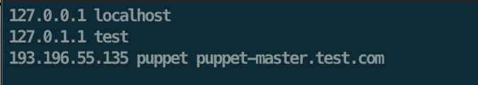
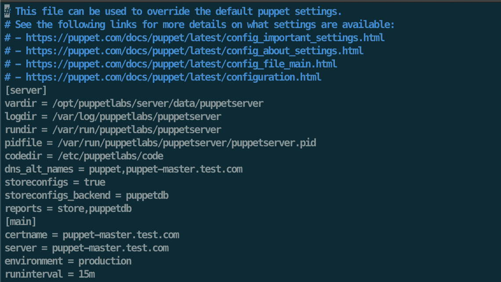
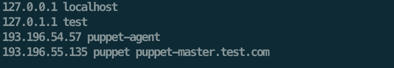
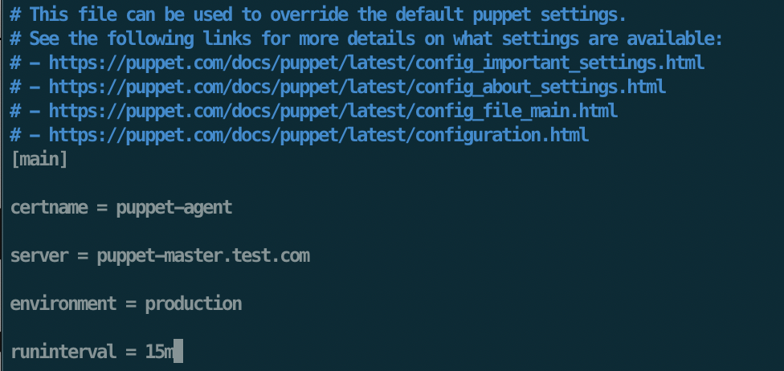
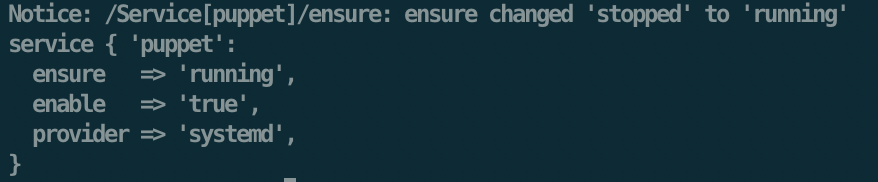
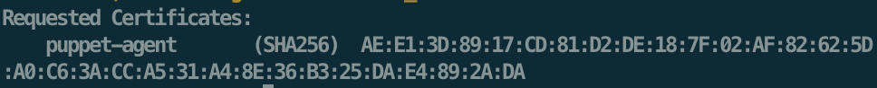
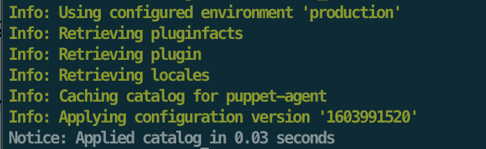
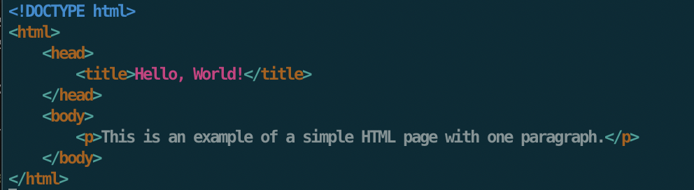
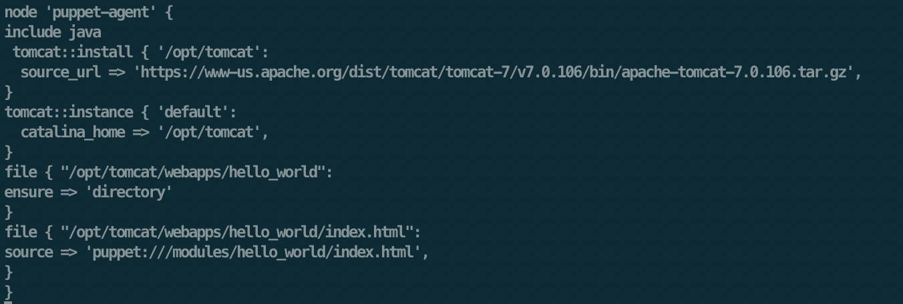

# Readme

This prototype is able to transform running applications deployed with Kubernetes, Puppet, AWS CloudFormation, or OpenStack Heat to a TOSCA Service Template Instance with additional management functionality that is manageable with the OpenTOSCA ecosystem.

# Developer Setup
This guide aims to provide help how to setup the EDMMi CLI and how to verify its functionality using a simple setup with a Puppet deployment that is enriched with management functionality using the OpenTOSCA ecosystem.
In the first section, an explanation is given how to set up a simple Puppet deployment which can be enriched later.
In the second section, it is shown which settings are required to run this prototype, and how to build and run it eventually.
In the third section, it is shown how to manage the Puppet deployment with additional management functionality using the OpenTOSCA ecosystem which is used in this prototype.

## Section 1 - Setup Puppet deployment
To test this prototype, this section explains how to setup a simple deployment consisting of a Puppet master, and a Puppet agent which is managed by the master.
Further, a declarative deployment model is provided that installs a simple piece of software on the Puppet agent.

### Step 1 - Setup two VMs
To setup a Puppet master, and a Puppet agent, respectively one machine is required that is able to run the Puppet master, respectively the Puppet agent.
Puppet currently only supports *nix machines as master.
For the simplicity of this guide, i am going to use simply two VMs running on OpenStack: One to run the Puppet master, and one to run the Puppet agent.

### Step 2 - Setup the Puppet Master
Now that we have a running VM with a *nix OS, this step shows how to setup the Puppet master on top of it.
Before Puppet is installed, a modification to the /etc/hosts file on both the master and the agent is required such that they can resolve each other.
So, for example my master's hostname is 'puppet-master', while my agent's hostname is 'puppet-agent'.

Following is the /etc/hosts file of the master:



```
# Puppet                                    
                                            
127.0.1.1 localhost                                          
[MASTER_IP] puppet puppet-master.test.com
```

Now, we can start to setup Puppet and PostgreSQL on the master. To do this, enter following command on the Puppet master:

```shell script
wget https://apt.puppetlabs.com/puppet6-release-bionic.deb
sudo dpkg -i puppet6-release-bionic.deb
sudo sh -c 'echo "deb http://apt.postgresql.org/pub/repos/apt $(lsb_release -cs)-pgdg main" > /etc/apt/sources.list.d/pgdg.list'
wget --quiet -O - https://www.postgresql.org/media/keys/ACCC4CF8.asc | sudo apt-key add -
sudo apt update
sudo apt -y install postgresql puppetserver
```

Puppet is installed now! Now we are going to configure the Puppet master. To do this, make following changes to the puppet.conf file:
 `sudo nano /etc/puppetlabs/puppet/puppet.conf`.

```
[main]
certname    = puppet-master.test.com
server      = puppet-master.test.com
environment = production
runinterval = 15m
```

Now, we setup the certificate authority by running:

```sudo /opt/puppetlabs/bin/puppetserver ca setup```

Once this is finished, we can start the Puppet master with following two commands:

```shell script
sudo systemctl enable puppetserver
sudo systemctl start puppetserver
```


Then, we are able to install PuppetDB. First, run these commands:

```shell script
sudo /opt/puppetlabs/bin/puppet resource package puppetdb ensure=latest
sudo /opt/puppetlabs/bin/puppet resource package puppetdb-termini ensure=latest
```

Now, it is required to configure PuppetDB. To do this, run the following command to create the first config file that is required:

```shell script
sudo nano /etc/puppetlabs/puppet/puppetdb.conf
```

and add the following content:

```puppet
[main]
server_urls = https://puppet:8081
```

Then, configure the puppetDB config file:

```sudo nano /etc/puppetlabs/puppetdb/conf.d/database.ini```

```puppet
[database]

# The database address, i.e. //HOST:PORT/DATABASE_NAME
subname = //localhost:5432/puppetdb

# Connect as a specific user
username = puppetdb

# Use a specific password
password = puppetdb

# How often (in minutes) to compact the database
# gc-interval = 60
```

Now, edit the `sudo nano /etc/puppetlabs/puppet/puppet.conf` file such that it looks like this:



```puppet
dns_alt_names        = puppet,puppet-master.test.com
storeconfigs         = true
storeconfigs_backend = puppetdb
reports              = store,puppetdb
```

Further, create a `routes.yaml` file in the same directory (`sudo nano /etc/puppetlabs/puppet/routes.yaml`) with the following content:

```yaml
---
master:
  facts:
    terminus: puppetdb
    cache: yaml
```


Now, run the following four commands to configure the PostgreSQL database to use it with PuppetDB. 
When prompted, enter `puppetdb` as password.

```shell script
sudo -u postgres sh

createuser -DRSP puppetdb
createdb -E UTF8 -O puppetdb puppetdb
psql puppetdb -c 'create extension pg_trgm'

exit
```

Now, restart the database:

```shell script
sudo service postgresql restart
```

Finally, start the PuppetDB up by firing this command:

```shell script
sudo /opt/puppetlabs/bin/puppet resource service puppetdb ensure=running enable=true
```

As a last step, we need to restart the Puppet server on the Puppet Master. This can be done for example by following commands:

```shell script
sudo kill -HUP `pgrep -f puppet-server`
sudo service puppetserver reload
```

### Step 3 - Setup the Puppet Agent

Enter the following commands on the Puppet Agent to install and setup Puppet.

First, edit the `sudo nano /etc/hosts` file of the agent:



```
# Puppet                                    
                                            
127.0.1.1 localhost                         
[AGENT_IP] puppet-agent                 
[MASTER_IP] puppet puppet-master.test.com
```

Next, download Puppet by following command:

```shell script
wget https://apt.puppetlabs.com/puppet6-release-bionic.deb
sudo dpkg -i puppet6-release-bionic.deb
sudo apt update
sudo apt install -y puppet-agent
```

Now, the Puppet Agent needs to be configured.
To do this, we edit the configuration file by running following command:

```shell script
sudo nano /etc/puppetlabs/puppet/puppet.conf
```

Edit the file such that it looks like this:



```puppet
[main]
certname    = puppet-agent
server      = puppet-master.test.com
environment = production
runinterval = 1y
```

Now it's time to start the Puppet Agent service by running this command:

```shell script
sudo /opt/puppetlabs/bin/puppet resource service puppet ensure=running enable=true
```

The output should look as shown below:



### Step 4 - Connect the Puppet Agent to the Puppet Master
Once all previous steps are finished, we need to enable the communication between the Puppet Agent and the Puppet Master we just set up.
Enter following command on the Puppet Master, to check if a certificate request from the Puppet Agent was already received:

```shell script
sudo /opt/puppetlabs/bin/puppetserver ca list
```

The output should be similar to this:



The certificate request can then be signed by running following command:

```shell script
sudo /opt/puppetlabs/bin/puppetserver ca sign --certname puppet-agent
```

The output should state that the certificate was signed successfully.
To check, run the following command on the Puppet Agent:

```shell script
sudo /opt/puppetlabs/bin/puppet agent --test
```

The output should be as shown below:



That's it! The Puppet Master and the Agent are now up and running, and connected.
Now, it is possible to manage the Puppet Agent via the Master.

### Step 5 - Install software on the Puppet Agent using the Puppet Master
In this step, an example is shown how to deploy a simple application using the *Puppet Master* and its managed agent that we just set up.
The simple application consists of a Tomcat web server that hosts a static website.

To run Tomcat, we need to install Java first.
Simply install the existing PuppetLabs module for Java by running this command:

```shell script
sudo /opt/puppetlabs/bin/puppet module install puppetlabs-java
```

Now, we need to create a manifest on the *Puppet Master* to actually install Java on the Puppet Agent using the module we just installed.
A manifest declares the resources to be deployed to a certain (or to all) agents managed by a Puppet Master.
To do this, create a `site.pp` file in following location on the Puppet Master:
 `sudo nano /etc/puppetlabs/code/environments/production/manifests/site.pp`
  and edit it such that it looks like this:


To apply the configuration, run following command on the *Puppet Agent*:

```shell script
sudo /opt/puppetlabs/bin/puppet agent --test
```

Once this was successful, we can install Tomcat.
To install Tomcat, we simply re-use the existing Tomcat module provided in PuppetForge.
To install the tomcat module, run following command on the *Puppet Master*:

```shell script
sudo /opt/puppetlabs/bin/puppet module install puppetlabs-tomcat --version 4.2.0
```

Once finished, go to the `site.pp` file we created in the previous step and edit it such that it looks like this:


Make sure that the Tomcat Version exists under the provided URL in the site.pp file.
Now, run following command on the Puppet Agent to retrieve the newest configuration we just declared:

```shell script
sudo /opt/puppetlabs/bin/puppet agent --test
```

Once this is done, we successfully installed and started a Tomcat server on the Puppet Agent. To verify, run following command on the Agent:

```shell script
ps -ef | grep tomcat
```

Now we are going to deploy a simple Hello-World HTML web page to the Tomcat using Puppet.
As a first step, create a html-file on the Puppet Master in `/etc/puppetlabs/code/environments/production/modules/hello_world/files/index.html` that looks, for example, like this:



To deploy this file to the Tomcat on the Puppet Agent, we modify our site.pp file from before such that it looks like this:



Again, execute this on the Puppet Agent to retrieve the newest configuration:

```shell script
sudo /opt/puppetlabs/bin/puppet agent --test
```

To verify that this worked, run following command on the Puppet Agent:

```shell script
curl localhost:8080/hello_world/
```

The output should show our HTML file we deployed to the Tomcat.
Tadaa, it is served on the Tomcat server.


