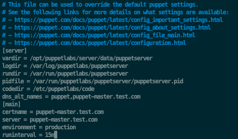
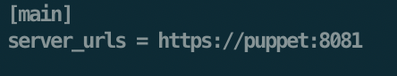
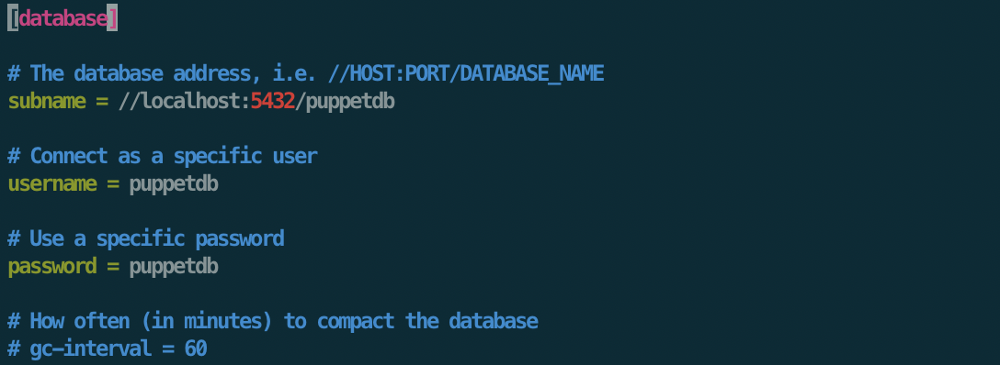
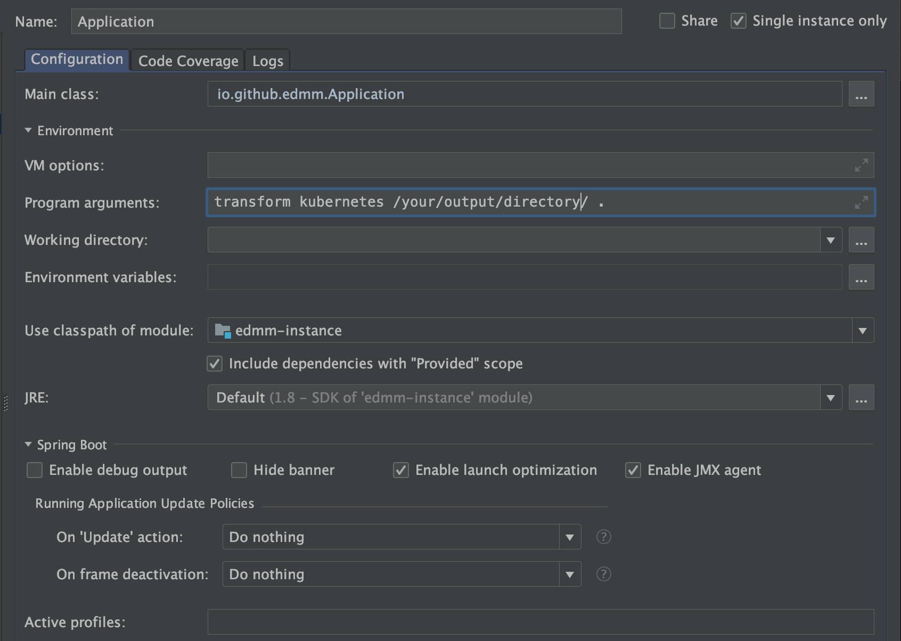

# Readme

This prototype is able to transform running applications deployed with Kubernetes, Puppet, AWS CloudFormation, or OpenStack Heat to a TOSCA Service Template Instance with additional management functionality that is manageable with the OpenTOSCA ecosystem.

# Developer Setup
This guide aims to provide help how to setup the EDMMi CLI and how to verify its functionality using a simple setup with a Puppet deployment that is enriched with management functionality using the OpenTOSCA ecosystem.
In the first section, an explanation is given how to set up a simple Puppet deployment which can be enriched later.
In the second section, it is shown which settings are required to run this prototype, and how to build and run it eventually.
In the third section, it is shown how to manage the Puppet deployment with additional management functionality using the OpenTOSCA ecosystem which is used in this prototype.

## Section 1 - Setup Puppet deployment
To test this prototype, this section explains how to setup a simple deployment consisting of a Puppet master, and a Puppet agent which is managed by the master.
Further, a declarative deployment model is provided that installs a simple piece of software on the Puppet agent.

### Step 1 - Setup two VMs
To setup a Puppet master, and a Puppet agent, respectively one machine is required that is able to run the Puppet master, respectively the Puppet agent.
Puppet currently only supports *nix machines as master.
For the simplicity of this guide, i am going to use simply two VMs running on OpenStack: One to run the Puppet master, and one to run the Puppet agent.

### Step 2 - Setup the Puppet Master
Now that we have a running VM with a *nix OS, this step shows how to setup the Puppet master on top of it.
Before Puppet is installed, a modification to the /etc/hosts file on both the master and the agent is required such that they can resolve each other.
So, for example my master's hostname is 'puppet-master', while my agent's hostname is 'puppet-agent'.

Following is the /etc/hosts file of the master:


Following is the /etc/hosts file of the agent:


Now, we can start to setup Puppet on the master. To do this, enter following command on the Puppet master:

```wget https://apt.puppetlabs.com/puppet6-release-bionic.deb```

Afterwards, execute following command to add and configure the Puppet repository:

```sudo dpkg -i puppet6-release-bionic.deb```

Followed by an update of the repository list:

```sudo apt update```

Now to actually install the Puppet master, we execute following command:

```sudo apt install -y puppetserver```

Puppet is installed now! Now we are going to configure the Puppet master. To do this, make following changes to the puppet.conf file:
 `sudo nano /etc/puppetlabs/puppet/puppet.conf`.



Now, we setup the certificate authority by running:

```sudo /opt/puppetlabs/bin/puppetserver ca setup```

Once this is finished, we can start the Puppet master with following two commands:

```sudo systemctl start puppetserver```

```sudo systemctl enable puppetserver```

Now, we setup PuppetDB on the Puppet Master.
To do this, we install a PostgreSQL server fist by running these commands:

```
sudo sh -c 'echo "deb http://apt.postgresql.org/pub/repos/apt $(lsb_release -cs)-pgdg main" > /etc/apt/sources.list.d/pgdg.list'

wget --quiet -O - https://www.postgresql.org/media/keys/ACCC4CF8.asc | sudo apt-key add -

sudo apt update

sudo apt -y install postgresql
```

Then, we are able to install PuppetDB. First, run these commands:

```
sudo /opt/puppetlabs/bin/puppet resource package puppetdb ensure=latest
sudo /opt/puppetlabs/bin/puppet resource package puppetdb-termini ensure=latest
```

Now, it is required to configure PuppetDB. To do this, run the following command to create the first config file that is required:

```sudo nano /etc/puppetlabs/puppet/puppetdb.conf```

and edit it such that it looks like this:



Then, enter following command to create the next config file:

```sudo nano /etc/puppetlabs/puppetdb/conf.d/database.ini```

and make it look like this:



Now, edit the `/etc/puppetlabs/puppet/puppet.conf` file such that it looks like this:


Further, create a `routes.yaml` file in the same directory (`sudo nano /etc/puppetlabs/puppet/routes.yaml`) with the following content:

```
---
master:
  facts:
    terminus: puppetdb
    cache: yaml
```


Now, run the following four commands to configure the PostgreSQL database to use it with PuppetDB:

```
sudo -u postgres sh

createuser -DRSP puppetdb

createdb -E UTF8 -O puppetdb puppetdb

psql puppetdb -c 'create extension pg_trgm'

exit
```

Now, restart the database:

```sudo service postgresql restart```

And, finally, start the PuppetDB up by firing this command:

```sudo /opt/puppetlabs/bin/puppet resource service puppetdb ensure=running enable=true```

As a last step, we need to restart the Puppet server on the Puppet Master. This can be done for example by following commands:

```
sudo kill -HUP `pgrep -f puppet-server
sudo service puppetserver reload
```

### Step 3 - Setup the Puppet Agent

Enter the following commands on the Puppet Agent to install and setup Puppet.
First, download Puppet by following command:

```wget https://apt.puppetlabs.com/puppet6-release-bionic.deb```

Then install the package by executing following command:

```sudo dpkg -i puppet6-release-bionic.deb```

After this, execute this obligatory command:

```sudo apt update```

Then, we setup the VM such that it acts as a Puppet Agent.
This process is started by following command:

```sudo apt install -y puppet-agent```

Now, the Puppet Agent needs to be configured.
To do this, we edit the configuration file by running following command:

```sudo nano /etc/puppetlabs/puppet/puppet.conf```

Edit the file such that it looks like this:


Now it's time to start the Puppet Agent service by running this command:

```sudo /opt/puppetlabs/bin/puppet resource service puppet ensure=running enable=true```

The output should look as shown below:


### Step 4 - Connect the Puppet Agent to the Puppet Master
Once all previous steps are finished, we need to enable the communication between the Puppet Agent and the Puppet Master we just set up.
Enter following command on the Puppet Master, to check if a certificate request from the Puppet Agent was already received:

```sudo /opt/puppetlabs/bin/puppetserver ca list```

The output should be similar to this:


The certificate request can then be signed by running following command:

```sudo /opt/puppetlabs/bin/puppetserver ca sign --certname puppet-agent```

The output should state that the certificate was signed successfully.
To check, run the following command on the Puppet Agent:

```sudo /opt/puppetlabs/bin/puppet agent --test```

The output should be as shown below:


That's it! The Puppet Master and the Agent are now up and running, and connected.
Now, it is possible to manage the Puppet Agent via the Master.

### Step 5 - Install software on the Puppet Agent using the Puppet Master
In this step, an example is shown how to deploy a simple application using the *Puppet Master* and its managed agent that we just set up.
The simple application consists of a Tomcat web server that hosts a static website.

To run Tomcat, we need to install Java first.
Simply install the existing PuppetLabs module for Java by running this command:

```sudo /opt/puppetlabs/bin/puppet module install puppetlabs-java```

Now, we need to create a manifest on the *Puppet Master* to actually install Java on the Puppet Agent using the module we just installed.
A manifest declares the resources to be deployed to a certain (or to all) agents managed by a Puppet Master.
To do this, create a `site.pp` file in following location on the Puppet Master:
 `sudo nano /etc/puppetlabs/code/environments/production/manifests/site.pp`
  and edit it such that it looks like this:


To apply the configuration, run following command on the *Puppet Agent*:

```sudo /opt/puppetlabs/bin/puppet agent --test```

Once this was successful, we can install Tomcat.
To install Tomcat, we simply re-use the existing Tomcat module provided in PuppetForge.
To install the tomcat module, run following command on the *Puppet Master*:

```sudo /opt/puppetlabs/bin/puppet module install puppetlabs-tomcat --version 4.2.0```

Once finished, go to the `site.pp` file we created in the previous step and edit it such that it looks like this:


Make sure that the Tomcat Version exists under the provided URL in the site.pp file.
Now, run following command on the Puppet Agent to retrieve the newest configuration we just declared:

```sudo /opt/puppetlabs/bin/puppet agent --test```

Once this is done, we successfully installed and started a Tomcat server on the Puppet Agent. To verify, run following command on the Agent:

```ps -ef | grep tomcat```

Now we are going to deploy a simple Hello-World HTML web page to the Tomcat using Puppet.
As a first step, create a html-file on the Puppet Master in `/etc/puppetlabs/code/environments/production/modules/hello_world/files/index.html` that looks, for example, like this:


To deploy this file to the Tomcat on the Puppet Agent, we modify our site.pp file from before such that it looks like this:


Again, execute this on the Puppet Agent to retrieve the newest configuration:

```sudo /opt/puppetlabs/bin/puppet agent --test```

To verify that this worked, run following command on the Puppet Agent:

```curl localhost:8080/hello_world/```

The output should show our HTML file we deployed to the Tomcat.
Tadaa, it is served on the Tomcat server.

## Section 2 - Run this prototype
Since this prototype uses the OpenTOSCA ecosystem to function properly, it is required to set it up.
The easiest way to achieve this is to run the OpenTOSCA ecosystem via Docker as described in [their documentation](https://www.github.com/opentosca/opentosca-docker/)

Once the OpenTOSCA ecosystem is up and running, we can run this prototype.
For example, to enrich the Puppet deployment described in the first section, it is required to edit the *io.github.edmm.plugins.puppet.PuppetInstancePluginLifecycle.java* file with the respective settings to access the Puppet master that was setup during the first section.
Following variables need to be set:
- user: the username of the VM of the Puppet Master, e.g. ubuntu
- ip: the public ipv4 address of the Puppet Master
- privateKeyLocation: the location of a private key valid to access the Puppet Master
- operationgSystem: the operation system of the Puppet Master, e.g. ubuntu
- operatingSystemRelease: the full release version name of the operating system of the Puppet Master, e.g. ubuntu-18.04

Once these variables are set, import this project in IntelliJ as Maven project and create a Spring Boot Run Configuration as follows:



Depending on the application that is to be transformed and enriched with management functionalities, enter the program arguments.
For example, to transform the deployment we set up in the first section, enter the program arguments as shown in the picture above, i.e.:

```transform puppet /your/output/directory/ .```

To transform, for example, a Kubernetes deployment, it is required to set the respective variables in *io.github.edmm.plugins.kubernetes.KubernetesInstancePluginLifecycle.java* and change the run configuration by replacing *puppet* with *kubernetes*. 
Same applies to the usage of the AWS CloudFormation and OpenStack Heat plugins.

Now, once everything is set up, and OpenTOSCA is running, the prototype can be run.
Simply run the run configuration that was created previously to start the prototype.


## Section 3 - Apply enriched management feature
Once the prototype ran successfully, open localhost:8088 in your browser to see the OpenTOSCA Management dashboard.
If everything worked, the application that was transformed using the prototype should appear there and be registered as running application.
Click on it, to see further details, like the current state.
If the application was enriched with additional management features, they appear at the bottom of the page, e.g. "test".
To run the management operations, simply click the "Play" button.
